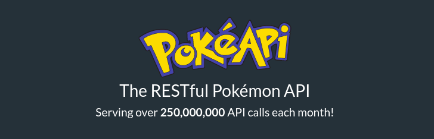

# POKE DB
A project site that displays various pokemon data.

### *Skills used*

#### - VueJS
The site is created using the VueJS framework.
#### - TailwindCSS
The CSS is mainly handled using the Tailwind CSS framework
#### - Promises(via the Pokemon Api)
The Pokemon data is retreived from the Public restful pokemon api
https://pokeapi.co/
